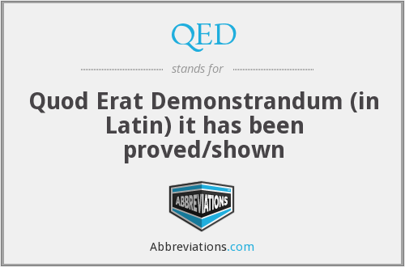

Proof by Contradiction
----------------------

### Proof by Contradiction

Prove that  _"Mike is a mortal."_

- direct proof
  + Use a theorem:  **All men are mortal.**
  + Use another fact:  **Mike is a man.**
  + Therefore **Mike is mortal.**
- contradiction
You probably argue with friends using this technique w/o realizing it
  + Invert the proposition:  **Mike is _immortal_.**
  + All men are mortal.
  + Mike is a man.
  + **_Mike is immortal_** is therefore `false`, a contradiction.

### Example #1

Prove that `$ \sqrt[3]{1332} > 11 $`

- &nbsp; <!-- .element: style="color: white" -->
- &nbsp; <!-- .element: style="color: white" -->
- &nbsp; <!-- .element: style="color: white" -->
- &nbsp; <!-- .element: style="color: white" -->
- &nbsp; <!-- .element: style="color: white" -->
- &nbsp; <!-- .element: style="color: white" -->
- &nbsp; <!-- .element: style="color: white" -->
- &nbsp; <!-- .element: style="color: white" -->

_Slide intentionally blank for solving demo, see the next slide if not viewing from the video_ <!-- .element: style="font-size: 0.5em; color: #2a76dd" -->

### Example #1

Prove that `$ \sqrt[3]{1332} \gt 11 $`

- Contradict the statement <!-- .element: class="fragment" -->
  * Suppose `$ \sqrt[3]{1332} \leq 11 $`
- Make the equation easier to work with <!-- .element: class="fragment" -->
  * `$ 1332 \leq 11^3 $`
- Simplify <!-- .element: class="fragment" -->
  * `$ 1332 \leq 1331 $`
- That's not true <!-- .element: class="fragment" -->
  * Therefore `$ \sqrt[3]{1332} \gt 11 $` is indeed **TRUE**

### Why use this _"crooked"_ method?

* A tip from [this site](http://cgm.cs.mcgill.ca/~godfried/teaching/dm-reading-assignments/Contradiction-Proofs.pdf):
  > In each case you should also think about how a direct ~~or contrapositive~~ proof would work. 
  > You will find in most cases that proof by contradiction is easier.

* Don't worry, proof by contradiction is [one of the standard styles of proof](http://discrete.openmathbooks.org/dmoi2/sec_logic-proofs.html)

### Example #2

Prove that `$ \sqrt{2} $` is irrational

- &nbsp; <!-- .element: style="color: white" -->
- &nbsp; <!-- .element: style="color: white" -->
- &nbsp; <!-- .element: style="color: white" -->
- &nbsp; <!-- .element: style="color: white" -->
- &nbsp; <!-- .element: style="color: white" -->
- &nbsp; <!-- .element: style="color: white" -->
- &nbsp; <!-- .element: style="color: white" -->
- &nbsp; <!-- .element: style="color: white" -->

_Slide intentionally blank for solving demo, see the next slide if not viewing from the video_ <!-- .element: style="font-size: 0.5em; color: #2a76dd" -->

### Example #2

Prove that `$ \sqrt{2} $` is irrational

- Contradict the statement <!-- .element: class="fragment" -->
  * Suppose `$ \sqrt{2} = \frac{n}{d} $`
    + meaning `$ \sqrt{2} $` is a rational number, a fraction
  * Any fraction `$ \frac{n}{d} $` can be simplified, no common prime factors
  * We're trying to prove `$ \sqrt{2} = \frac{n}{d} $`
- Find something that will help disprove contradiction <!-- .element: class="fragment" -->
  * If we can prove that `$ n $` and `$ d $` are **both even**, then that will:
    + disprove _"`$ n $` and `$ d $` have no prime common factors"_, which will then
    + disprove `$ \sqrt{2} $` is rational

### Example #2

Prove that `$ \sqrt{2} $` is irrational

- Make the equation easier to work with
  * `$ \sqrt{2} = \frac{n}{d} $`
    + our contradiction, claiming `$ \sqrt{2} $` is rational
  * `$ \sqrt{2}d = n $`
    + multiply both sides by `$ d $`
  * `$ 2d^2 = n^2 $` equation (1)
    + remove annoying square roots
- Prove <!-- .element: class="fragment" --> that both `$ n $` and `$ d $` are **EVEN**

### Example #2

Prove that `$ \sqrt{2} $` is irrational

- Prove <!-- .element: class="fragment" --> that `$ n $` is **EVEN**
  * Get help from other math theorems:  <!-- .element: class="fragment" -->
    + All even numbers can be expressed in the form `$ 2k $`
    + All odd numbers can be expressed in the form `$ 2k + 1 $`
  * Since  <!-- .element: class="fragment" --> `$ n^2 = 2d^2 $`, `$ n^2 $` is **even** 😱🌈🦄
    * `$ n^2 $` is even because we can substitute `$ 2d^2 $` with `$ 2k $`
    * if `$ n^2 $` is even, **THEN** `$ n $` is also even because:
      + it's a product of 2 numbers `$ n \cdot n $`
      + if `$ n $` is odd, then `$ n^2 = n \cdot n $` is odd
      + if `$ n $` is even, then `$ n^2 = n \cdot n $` is even

### Example #2

Prove that `$ \sqrt{2} $` is irrational

- Prove <!-- .element: class="fragment" --> that `$ d $` is **EVEN**
  * We now **know** that `$ n $` is even so `$ n = 2k $`
  * `$ n^2 = 4k^2 $`
    + We _square again_ so we can substitute `$ n^2 $` with `$ 2d^2 $` from eq. (1)
    + eq. (1) can be found from [slide 14](#/1/6/0)
  * `$ 2d^2 = 4k^2 $`
  * `$ d^2 = 2k^2 $`
  * `$ d^2 $` is even (`$ 2k^2 $` is in the form `$ 2 \cdot k $`), therefore `$ d $` is even
    + see last bullet from [last slide](#/1/7/2)

### End proofs with QED

- The numerators `$ n $` and `$ d $` are both even, common prime factor is 2
- Therefore _`$ \sqrt{2} $` is irrational_ `$ Q.E.D. $`

### Example #3

Prove that there exist no integers `$a$` and `$b$` for which `$ 21a + 30b = 1 $`.

- &nbsp; <!-- .element: style="color: white" -->
- &nbsp; <!-- .element: style="color: white" -->
- &nbsp; <!-- .element: style="color: white" -->
- &nbsp; <!-- .element: style="color: white" -->
- &nbsp; <!-- .element: style="color: white" -->
- &nbsp; <!-- .element: style="color: white" -->
- &nbsp; <!-- .element: style="color: white" -->
- &nbsp; <!-- .element: style="color: white" -->

_Slide intentionally blank for solving demo, see the next slide if not viewing from the video_ <!-- .element: style="font-size: 0.5em; color: #2a76dd" -->

### Example #3

Prove that there exist **no integers** `$a$` and `$b$` for which `$ 21a + 30b = 1 $`.

- Suppose `$a \in \mathbb{Z} $` and `$b \in \mathbb{Z} $` for which `$ 21a + 30b = 1 $`.
- Factoring: `$ 3(7a + 10b) = 1 $`
- It's now a contradiction, `$ 7a + 10b $` must become `$ \frac{1}{3} $`, which is impossible if
  `$a$` and `$b$` are integers
- _"1 must be a multiple of 3"_ is also another contradiction

### Conventions

* Just like coding conventions, we can make our proofs easier to read by following conventions.
  1. Write, _“We use proof by contradiction.”_
  2. Write, _“Suppose `$P$` is false.”_
    - where P is the proposition being proved
  3. Deduce something known to be false (a logical contradiction).
  4. Write, _“This is a contradiction. Therefore, `$P$` must be true; Q.E.D.”_

**A proof is an essay, not a calculation.**

### Example #4

Prove that if `$ n \in \mathbb{Z} $` and `$n$` is odd, then `$ n^2 $` is odd.

- &nbsp; <!-- .element: style="color: white" -->
- &nbsp; <!-- .element: style="color: white" -->
- &nbsp; <!-- .element: style="color: white" -->
- &nbsp; <!-- .element: style="color: white" -->
- &nbsp; <!-- .element: style="color: white" -->
- &nbsp; <!-- .element: style="color: white" -->
- &nbsp; <!-- .element: style="color: white" -->
- &nbsp; <!-- .element: style="color: white" -->

_Slide intentionally blank for solving demo, see the next slide if not viewing from the video_ <!-- .element: style="font-size: 0.5em; color: #2a76dd" -->

### Example #4, following conventions

* Prove that if `$ n \in \mathbb{Z} $` and `$n$` is odd, then `$ n^2 $` is odd.
  - We use proof by contradiction. 
  - Suppose _if `$ n \in \mathbb{Z} $` and `$n$` is odd, then `$ n^2 $` is even_
  - If `$n$` is odd, then `$ n = 2k + 1 $`
  - It follows that `$ n^2 = (2k + 1)^2 $`
  - `$ n^2 = 4k^2 + 4k + 1 $`
  - `$ n^2 = 2(2k^2 + 2k) + 1 $`
  - But the previous equation is in the form `$ n^2 = 2k + 1 $`, showing that `$ n^2 $` is an odd
    number.
  - This is a contradiction, therefore if `$ n \in \mathbb{Z} $` and `$n$` is odd, then `$ n^2 $` 
    must be odd; Q.E.D.