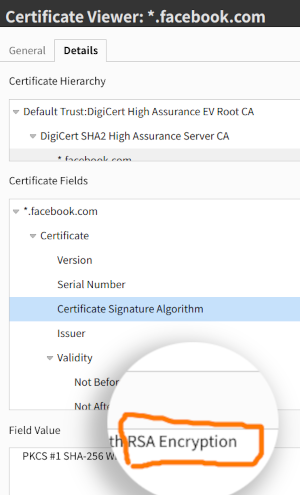
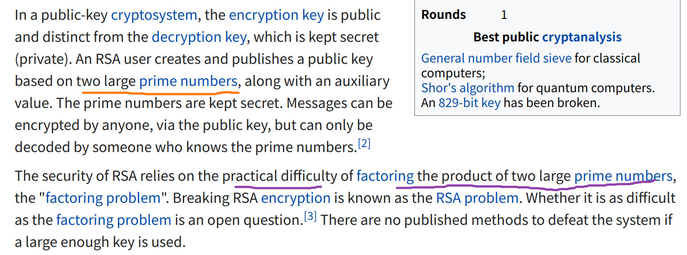
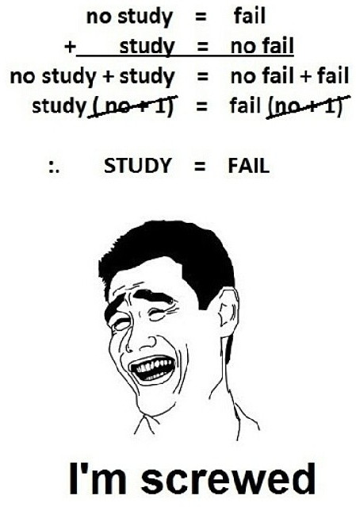
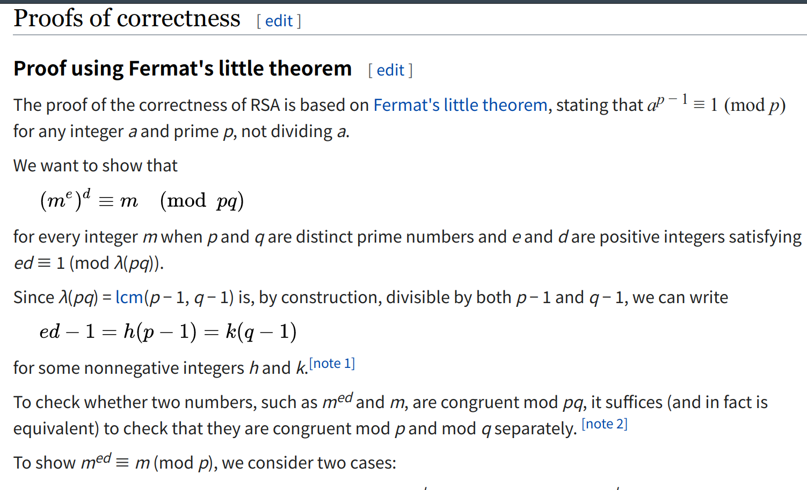
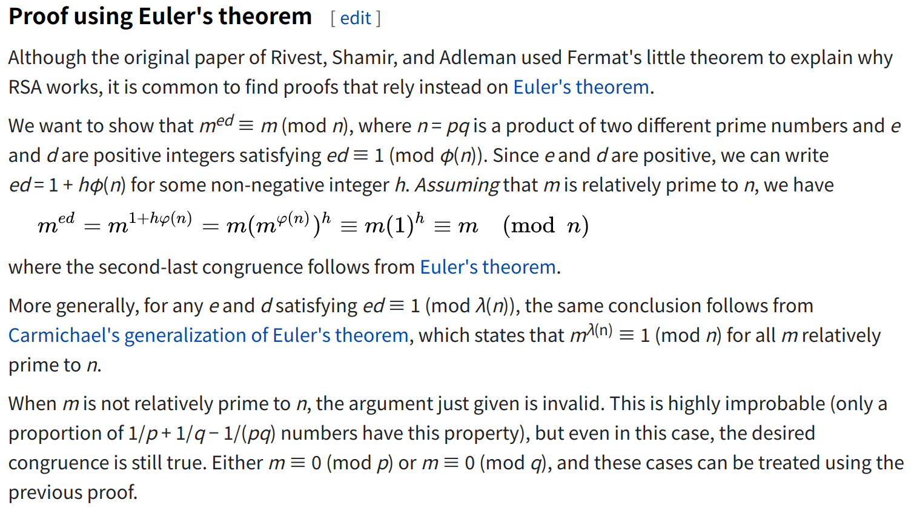

Proofs
------

<small>
  &lt;/&gt;
  <a href="https://github.com/psse-cpu/emath-2102-obs-workshop-sample">
    https://github.com/psse-cpu/emath-2102-obs-workshop-sample
  </a>
</small>

<h4 style="margin-top: 192px; font-size: 0.85em;">
  EMath 2102
  Discrete Mathematics II for SE
</h4>

  <b>Richard Michael Coo</b> |

  
  
  @myknbani

### Learning Objectives

  

  
  * At the end of watching this video, students will be able to:
    - understand why we need to study proofs <!-- .element class="fragment" style="margin-top: 32px" -->
    - prove or disprove a statement using proof by contradiction <!-- .element class="fragment" style="margin-top: 32px" -->
  

  

    
  

### Why Study Proofs?

  

  
  * Many things in CS* requires an answer to:
    - _"Does something work?"_ <!-- .element style="color: purple; font-weight: 700" -->
  * Does SSL and HTTPS really protect sensitive data during transit?
    - credit card number
    - passwords
    - confidential mental health chat
    
    
  *<small>remember that CS is the science that powers SE</small>
  

  

    
  

### Online shopping is safe due to prime numbers!

That's the very core math powering RSA

### Mathemtical Proof is the Key

  

  
  * Why not?
    - transmit some random data
    - test that hackers can't snoop on and steal the data
    - profit!
  * The things you didn't include in the random sample
    - are they safe too?
    
  

  

    
  

### Proof #1

### Proof #2

